# TREINAMENTO FISCAL - Luiz Otavio 

# DIA: 20/03/2025

### 📍 INFORMAÇÕES IMPORTANTES REF. A ROTINA:

> **Pedido de compra/venda ou romaneio, não movimenta a contabilidade.**

> **Começamos pelo T500 que seria o pedido de venda a onde eu informo a quantidade para atender o pedido, depois faço o movimento T510 que seria o romaneio referente o pedido de venda, gerando uma confirmação da quantidade do meu pedido e o T520 é a geração da nota fiscal de saída.** 
> - T500 = PEDIDO DE VENDA
> - T510 = ROMANEIO DE SAIDA
> - T520 = NOTA FISCAL DE SAIDA

**Como eu realizo a porcentagem do grupo de comissão?**
- Eu vou no modulo comercial e abrir a aba grupo de comissão por venda, apos isso selecionar qual grupo eu quero adicionar o meu vendedor a este grupo (linha de produto), apos isso amarrar o cliente ao vendedor para que o vendedor tenha acesso a linha e a porcentagem cadastrada.

**A onde eu amarro o grupo de comissão ?**
  - Em itens na aba comercial informe o grupo de comissão. 

**Configurações de TMV (Pelo sisatak)** 
  - CSM001
    - Informar o tmv que será configurado
    - T500
    - Aba itens

**Oque é importante para realizar um pedido de venda ?**
  - No sistema entre no sisatak, e abra a MOV011, e informe o movimento de pedido de venda, la informamos o cliente que estava vinculado ao vendedor, o item que esta vinculado a porcentagem que o vendedor ira ganhar pela venda do item, na aba parcelamento verificar se a carteira esta informada corretamente, caso ela nao esteja entre no perfil do cliente na aba financeiro, carteira fixa ? deixe não

---

# Passo 1: GRUPO DE COMISSÃO:
---

📌 ERP > Modulo Comercial > Cadastro > Grupo de comissão de produto e vendedor.

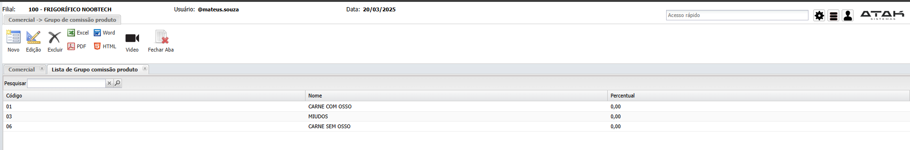

**No grupo comissão de produto fazemos o vinculo do vendedor.**

- Carne com osso
- Miudos
- Carne sem osso

---

>select * from tbGrupoCmsvVend
>where Cod_grupo_cmsv in (01,03,06)
>and cod_cadastro in (select tcg.Cod_cadastro
>from tbCadastroGeral tcg 
>where tcg.Tipo_cadastro  = 'V'
>and tcg.Nome_cadastro like '%mateus%')

**Esse comando pode ser utilizado para verificar se os itens cadastrado no grupo de comissão deram certos.**

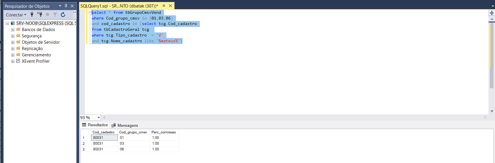

---
# PASSO 2: INFORMAR O GRUPO DE COMISSÃO NO CADASTRO DO ITEM: 

📌 ERP > Modulo Estoque > Item > Aba comercial > Grupo de Comissão.

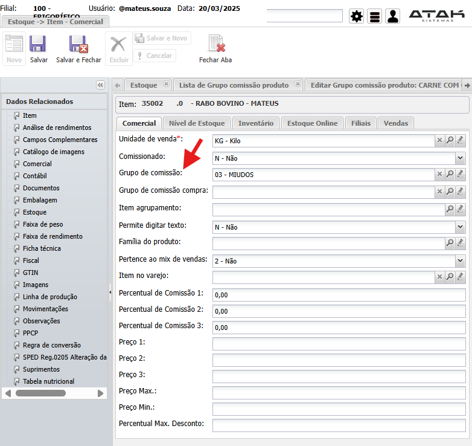

**Aqui inserimos na aba comercial o grupo de comissão condigente com a caracteristica do item.**

---

# Passo 3: PEDIDO DE VENDA

📌 Sisatak > MOV011 > T500 > Salvar > Atualizar o documento.

**Aqui informamos o cliente, e a quantidade do item, como informamos a porcentagem de comissão para aquele vendedor ele ja aparecerá assim que informarmos o item, lembrando que essa % foi informado no passo 1 (GRUPO DE COMISSÃO) que informamos o vendedor para aquele (GRUPO) do item**

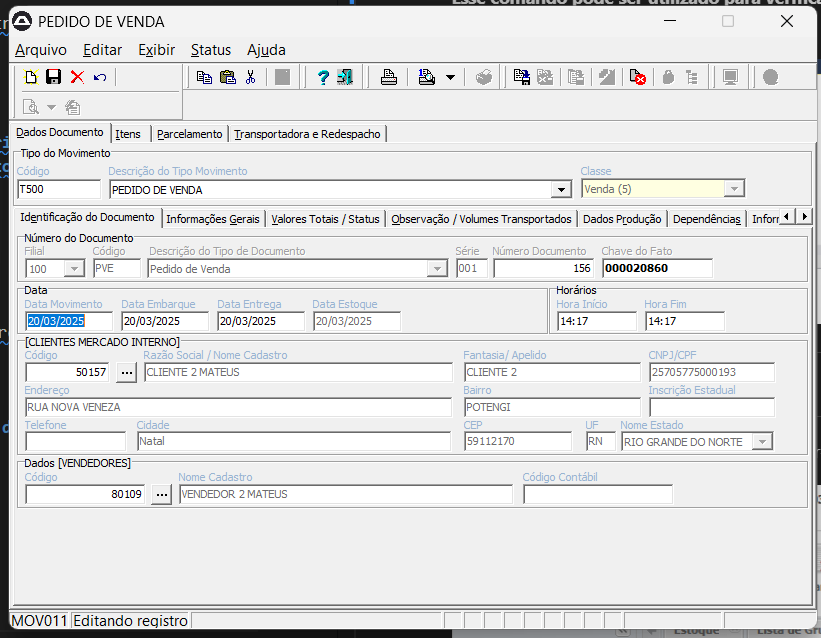
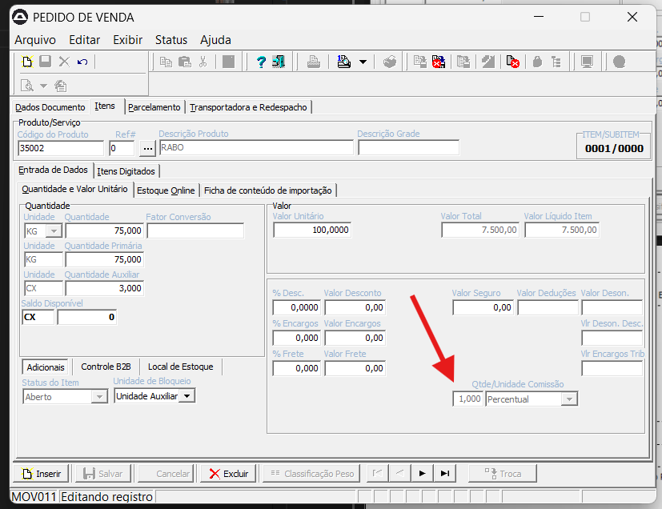
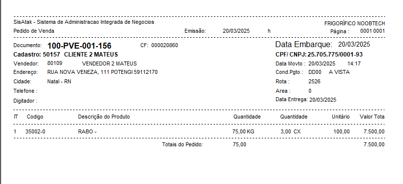

# PASSO 4: ROMANEIO DE SAIDA

📌 Sisatak > IND048 > T510 (Romaneio) > Movimentação 

**Aqui estamos fazendo o romaneio de saida, nele informamos o documento de origem realizado pelo pedido de venda e fazemos a pesagem do item indicando o volume.**

**filial = 100**
Série = 200
Nº do volume = 000000**

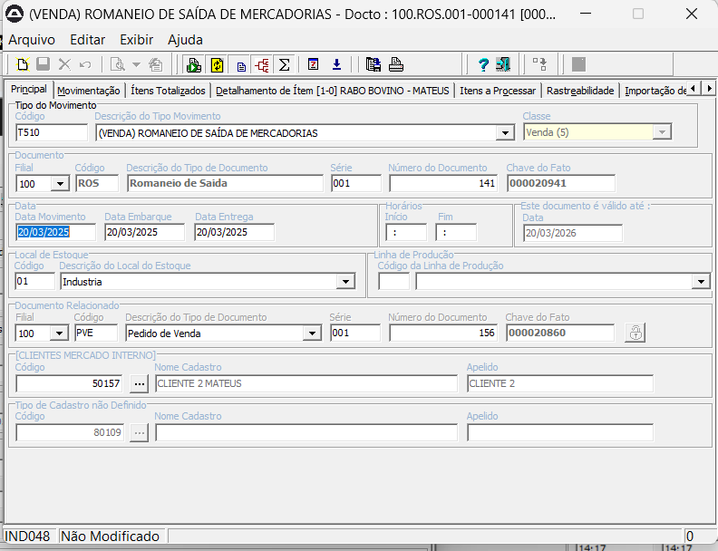
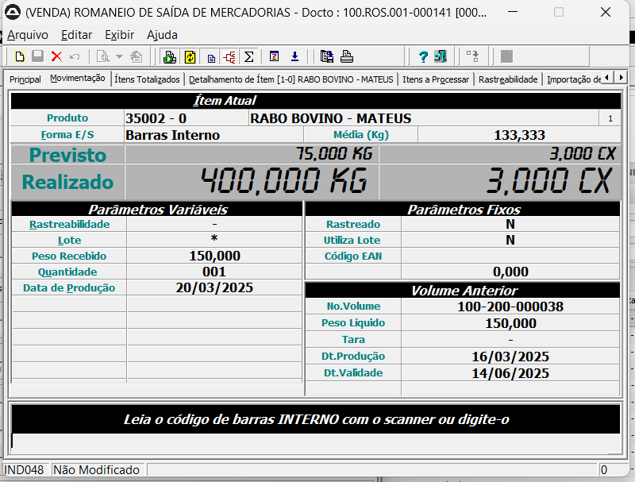

# PASSO 5: ATUALIZAR O ROMANEIO:

📌 Sisatak > MOV011 > T510 > Informe o numero do documento gerado no T500 > Atualizar o documento.

**Após a fazer a pesagem do item, é necessario fazer a atualização do documento, é nele que de fato realizamos a geração do romaneio.**

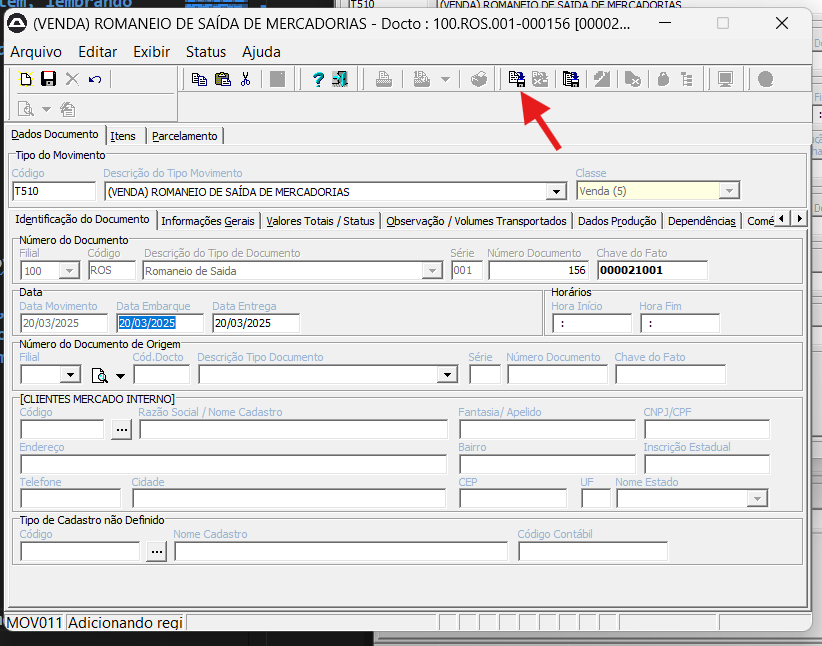

# PASSO 6: NOTA FISCAL DE SAIDA:

📌 Sisatak > MOV011 > T520 > Informe o nuemro de documento gerado no T510 > Atualizar o documento.

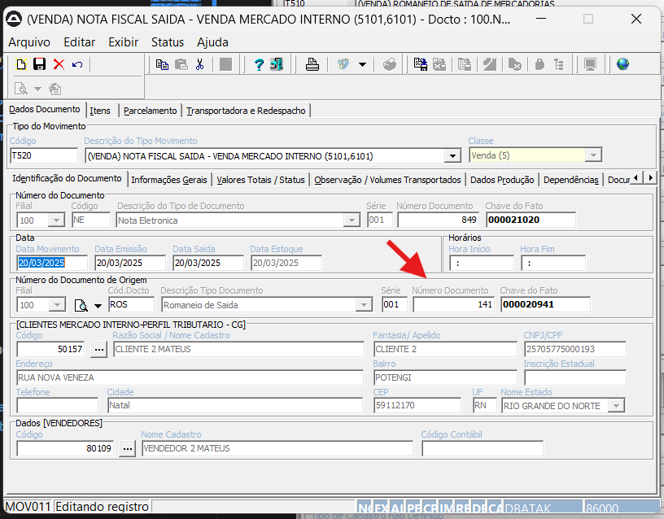

**Obs: Nesse passo utilizamos 3 tipos de movimento (TMV):**

> - T500 = PEDIDO DE VENDA
> - T510 = ROMANEIO DE SAIDA
> - T520 = NOTA FISCAL DE SAIDA

# PASSO 7: MONTAGEM DE CARGA

Sisatak > Montagem de carga (MOV020) > Selecione a rota > Selecione o romaneio > Salvar!

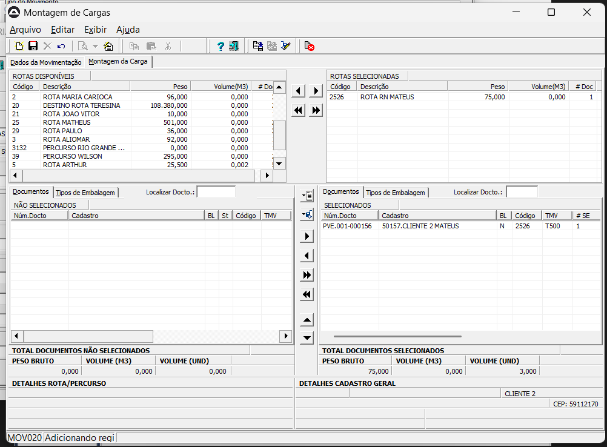

---

# DIA: 21/03/2025

 **ERP:**
> - 📌 Criar um Vendedor - V
> - 📌 Criar um Cliente - C

---

**SISATAK:**
> - 📌 MOV011 > T500
> - 📌 IND048 > T510
> - 📌 MOV011 > T520
> - 📌 Montagem de carga
> - 📌 Movimentação de Saída expedição Agíl (IND058)

# PASSO 8: LOTE NF-E

> - 📌 Sisatak > Módulo NF-E > NF-E > Lote NF-E
l

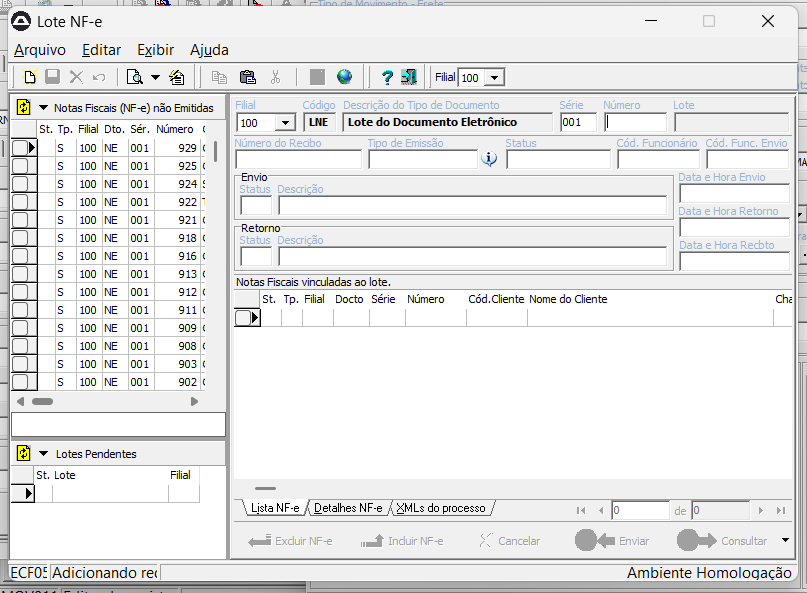

**OBS: Apartir desse passo que é gerado o xml da nota fiscal, caso o email do cliente esteja cadastrado ele sera encaminhado para o email do cliente.**

---

24/03/2025

# PASSO 9: VALORIZAR O ROMANEIO:

> - 📌 Sisatak > MOV012 > T210 > Procurar o romaneio de abate, (Ele ira trazer os campos de intens vazio, para que seja valorizado o romaneio, siga os passos a seguir).

> - 📌 Sisatak > MOV024 > T210 > Inserir o numero d romaneio > clicar no icone da vaca > ele ira aparecer uma tela com o lote do romaneio, precificar o valor do boi por lote, assim que fechar ele ira carregar o valor para a aba itens > atualizar o documento.

# PASSO 10: EMISSÃO DE NOTA FISCAL:

> - 📌 Sisatak > T220 > Informe o numero do romaneio > Verificar se a tributação esta correta para o item.

## Importante:

*OBS: Caso a tributação nao apareça, seguir os seguintes passos:*
 - Módulo Fiscal
   - Tributação por TMV
   - Cadastrar os impostos no TMV 220 (ICMS).

> - 📌 Erp > Escrita fiscal > Tributação por TMV 

  - FUNRURAL
  - GILRAR
  - SENAR

# PASSO 11: Lote NF

> - 📌 Sisatak > CTB001 > 

# Oque é Tributação ?

A criação de uma tributação envolve a combinação de diversos fatores e elementos que compõem o sistema tributário. Aqui estão algumas "junções" ou aspectos fundamentais para estruturar uma tributação:

- **Base de Cálculo:** Determinar sobre o que o tributo será aplicado, como renda, consumo, patrimônio ou transações financeiras.
- **Alíquota:** Definir a porcentagem ou valor fixo que será aplicado sobre a base de cálculo.
- **Fato Gerador:** Identificar o evento ou situação que dá origem à obrigação tributária, como a compra de um produto ou o recebimento de renda.
- **Sujeito Ativo e Passivo:** Estabelecer quem cobra o tributo (sujeito ativo, geralmente o governo) e quem deve pagá-lo (sujeito passivo, como empresas ou indivíduos).
- **Regime Tributário:** Escolher o regime aplicável, como Simples Nacional, Lucro Presumido ou Lucro Real, no caso de empresas.
- **Legislação e Normas:** Criar leis e regulamentos que definam as regras para a cobrança e administração do tributo.
- **Finalidade:** Determinar o objetivo do tributo, como financiar serviços públicos, redistribuir renda ou incentivar/desincentivar comportamentos específicos.

Esses elementos são ajustados de acordo com o contexto econômico, social e jurídico de cada país ou região.

# PASSO 12: Devolução

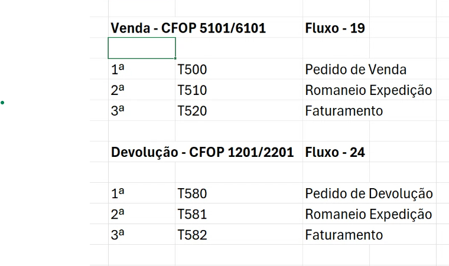

> - 📌 Sisatak > MOV011 - T520 (Nota fiscal de saída).
> - 📌 Sisatak > MOV012 - T580 (Autorização de devolução).
> - 📌 Sisatak > IND049 - T581 (Romaneio de devolução). 
>      - Ler o codigo de barras interno do volume.

*OBS: Caso não tenha o volume em maos, abra a IND048 com o T510, informe o numero gerado no T510 na MOV011.*

> - 📌 Sisatak > MOV012 > T581 > Informe o nº do doc gerado na IND049.
> - 📌 Sisatak > MOV012 > T582 > Verificar os dados fiscais e a contabilidade > Salvar > Atualizar o documento

1. **NF-e (Nota Fiscal Eletrônica - Modelo 55):**
   - É o documento principal usado para registrar operações de entrada e saída de mercadorias.
   - A **NF-e** é emitida por empresas para formalizar transações como vendas, devoluções, transferências de mercadorias ou até mesmo operações interestaduais.
   - É essencial para calcular os tributos, registrar as operações fiscais e fornecer rastreabilidade às mercadorias.

2. **CT-e (Conhecimento de Transporte Eletrônico - Modelo 57):**
   - Relaciona-se diretamente ao transporte de mercadorias.
   - A **CT-e** é emitida pelas transportadoras para registrar o transporte da carga. Ele indica o que está sendo transportado, seu destino e outras informações logísticas.
   - Está vinculado à NF-e, pois faz referência a ela para identificar as mercadorias que estão sendo transportadas.

3. **MDF-e (Manifesto Eletrônico de Documentos Fiscais - Modelo 58):**
   - Esse documento é uma espécie de agrupador. Ele consolida várias NF-es e CT-es quando há múltiplas entregas ou rotas.
   - É emitido para acompanhar o transporte físico das mercadorias, especialmente em longas distâncias ou quando há diferentes pontos de entrega.
   - O **MDF-e** se vincula ao CT-e, organizando os conhecimentos de transporte relacionados às várias notas fiscais que podem estar na mesma operação de transporte.

**Como eles se conectam:**
- A **NF-e** representa a transação de mercadorias (entrada/saída).
- A **CT-e** conecta essa transação ao transporte, registrando o deslocamento físico das mercadorias.
- O **MDF-e** organiza e agrupa as operações de transporte para facilitar a gestão e rastreabilidade de cargas.

Essa cadeia de documentos é essencial para garantir conformidade fiscal, transparência e organização logística. 

# PASSO 13: NF-e > CT-e > MDF-e:

> - 📌 Sisatak > MOV011 > T500 > Faço um pedido de venda.
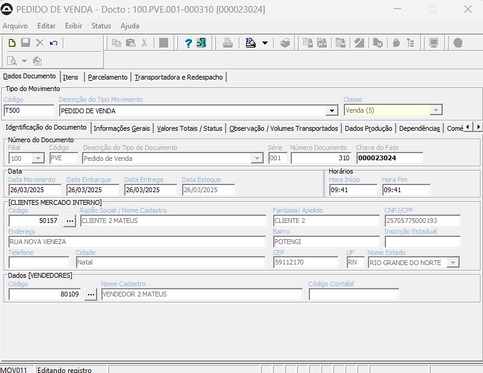

> - 📌 Sisatak > MOV020 > Montagem de carga > Aqui vou informar o  percurso e o motorista para o transporte do pedido de venda: 
>   - Gerar MDF-e 
>   - MDFe's Geradas 
>   - 2 cliques 
>   - Informar o contratante:
>     - dados do transporte 
>     - Seguro/Pedágio 
>     - Produto predominante 
>     - Lembrar de deixar o 'Status' como fechado.
>
>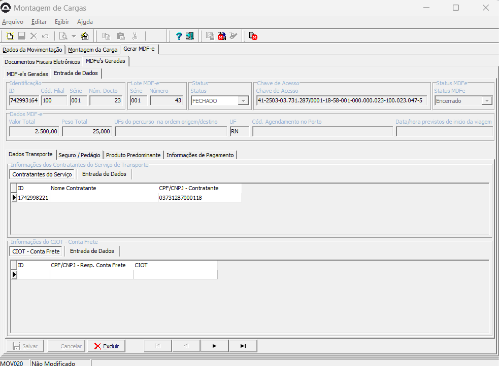

> - 📌 Sisatak > MOV011 > T510 > Realizo o romaneio de saída.
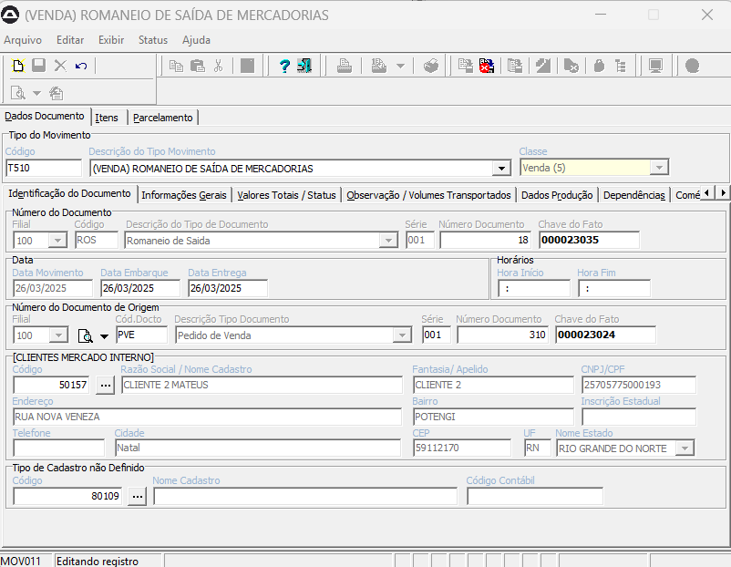

> - 📌 Sisatak > MOV011 > T520 > Faço a nota fiscal de saída.
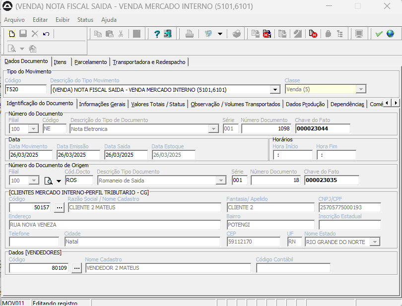

> - 📌 Sisatak > MOV020 > Montagem de carga > Faço a geração do Mdf-e.
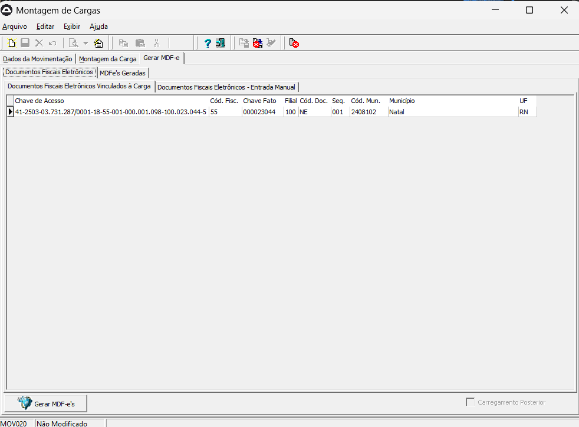

> - 📌 Sisatak > ECF115 > Lote de manifesto Eletronico de Doc > Aqui eu vou fazer a transmissão do Mdf-e. > Faço a inclusão da nota > Faço o envio > Faço a consulta.
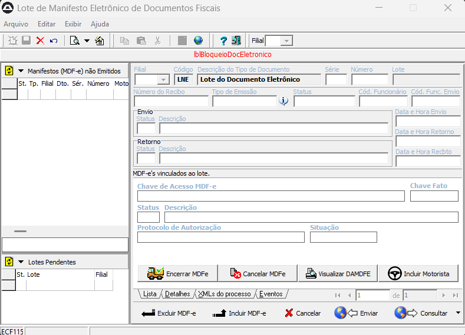

> - 📌 Sisatak > MOV020 > Montagem de carga > Gerar MDF-e > MDFe-s Geradas > Encerrar MDF-es.
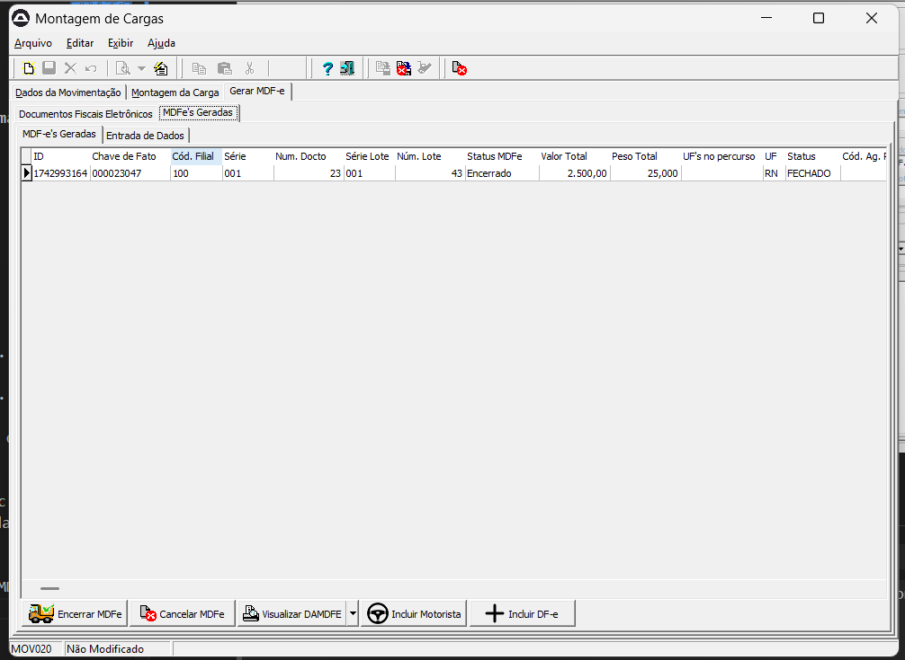

# PROCESSO PARA GERAR O CT-E:

- 📌 Sisatak > MOV092 > T147

   - Agrupa documento ?
     - Se eu flegar gerar um ct-e por documento > selecionar apenas quando for mais que um destino a carga
     - Gerar Apenas um CT-e > Selecionar quando for apenas um destino.
   - Tributação:

No contexto de transporte e tributação, cada um desses termos tem um papel específico. Aqui está uma explicação sobre cada um deles:

- **Tomador**: É a pessoa física ou jurídica responsável pelo pagamento do frete. A tributação pode variar dependendo do tipo de contrato (CIF ou FOB). No CIF, o remetente é o tomador; no FOB, o destinatário geralmente assume esse papel.

- **Remetente**: É quem envia a mercadoria. Normalmente, é o responsável pela emissão da nota fiscal e pode ser tributado dependendo do tipo de operação e do contrato de transporte.

- **Destinatário**: É quem recebe a mercadoria no destino final. A tributação pode incidir sobre ele, especialmente em contratos FOB, onde ele é o tomador do frete.

- **Recebedor**: É quem recebe a carga de forma intermediária, como em casos de redespacho. Ele não é o destinatário final, mas pode ser envolvido em operações tributáveis dependendo do tipo de serviço.

- **Expedidor**: É quem entrega a carga ao transportador. Em operações multimodais ou de redespacho, ele pode ser diferente do remetente e pode ter obrigações tributárias específicas.

Nesse caso deixamos como Tomador

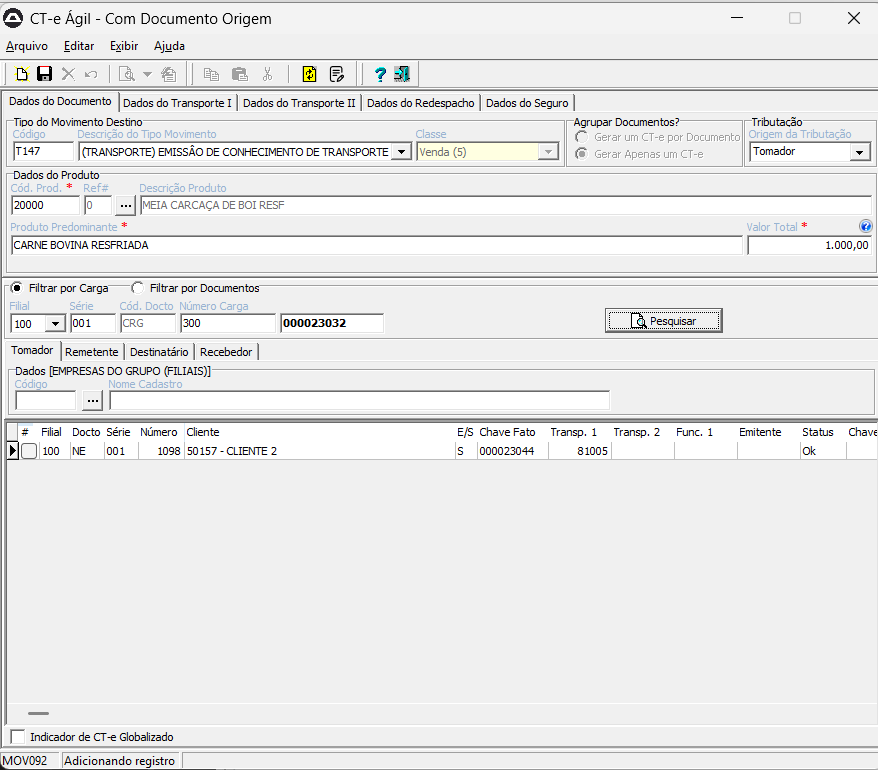

  - Dados do produto
    - Cod. do produto
    - Descrição do produto predominante
    - Valor total > Valor para o frete (Caso tenha mais que uma entrega lembrar de somar o valor e colocar o valor total, após gerar o CT-E ele faz o rateio do valor do frete caso tenha mais quem uma entrega)
  - Filtrar por carga > Pesquisar
  - Preencher as 'ABAS'
    - Tomador
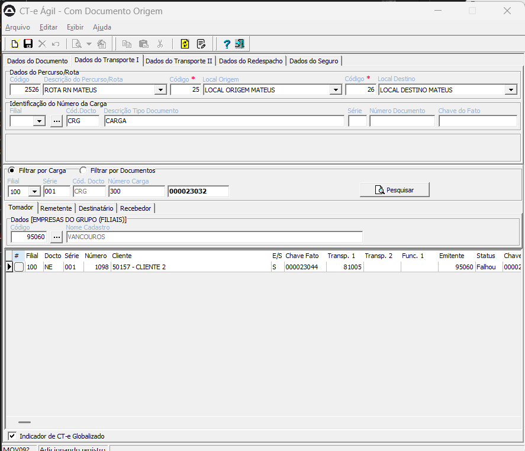
    - Remetente
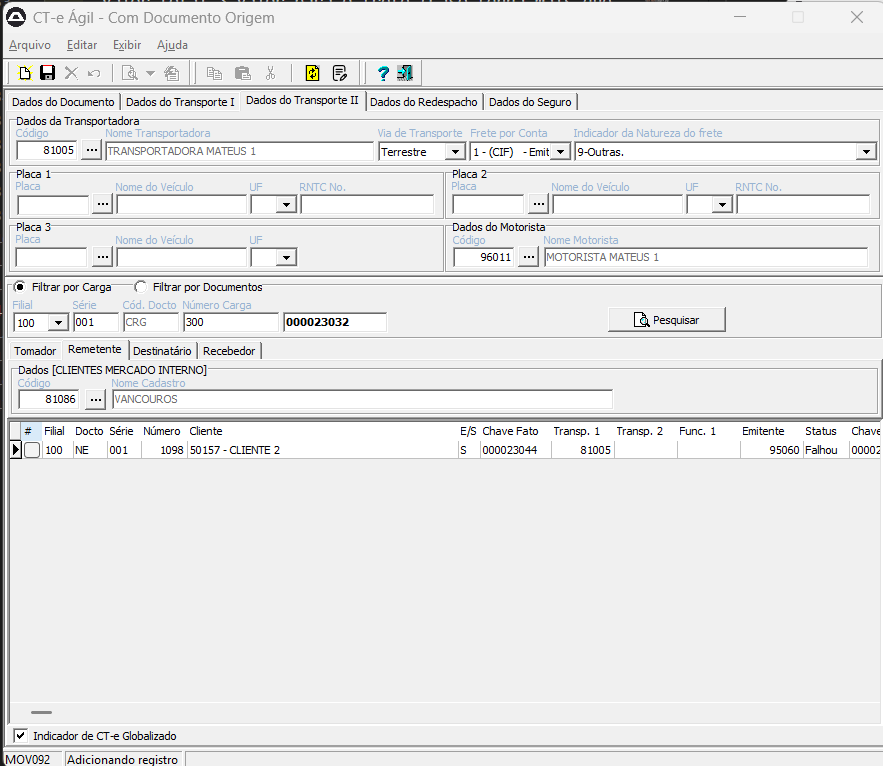
    - Destinatário
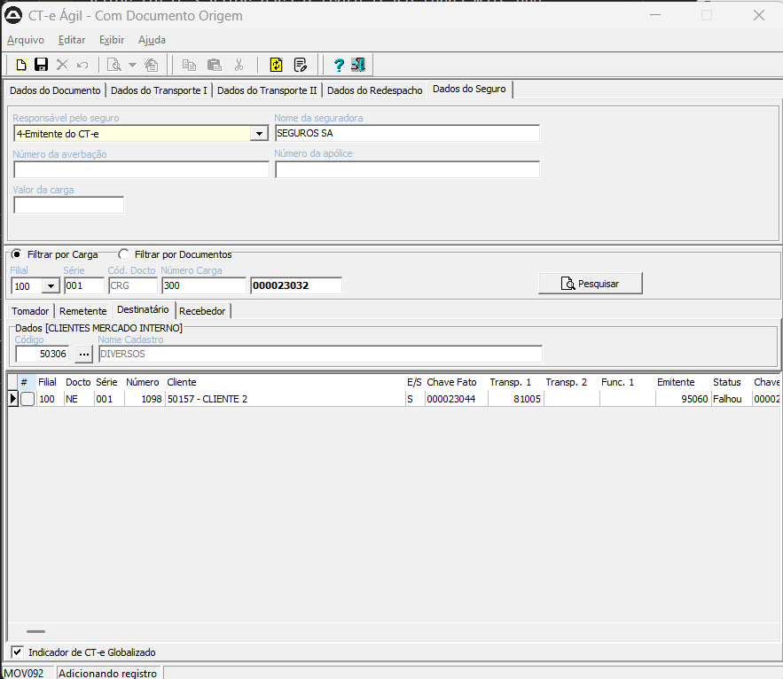

  - Preencher as 'ABAS'
    - Dados do transporte I

    - Dados do transporte II

    - Dados do seguro

