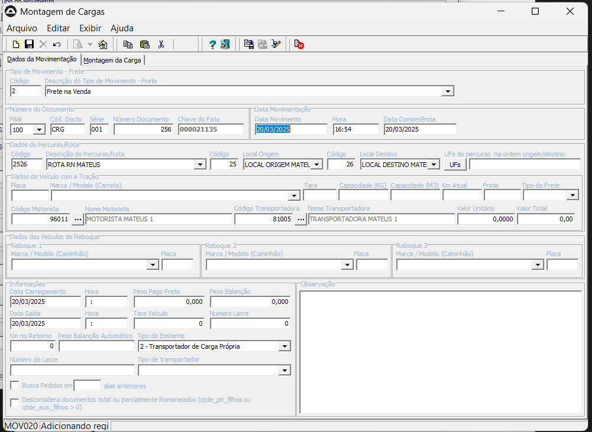

# TREINAMENTO FISCAL - Luiz Otavio 

# DIA: 20/03/2025

### 📍 INFORMAÇÕES IMPORTANTES REF. A ROTINA:

> **Pedido de compra/venda ou romaneio, não movimenta a contabilidade.**

> **Começamos pelo T500 que seria o pedido de venda a onde eu informo a quantidade para atender o pedido, depois faço o movimento T510 que seria o romaneio referente o pedido de venda, gerando uma confirmação da quantidade do meu pedido e o T520 é a geração da nota fiscal de saída.** 
> - T500 = PEDIDO DE VENDA
> - T510 = ROMANEIO DE SAIDA
> - T520 = NOTA FISCAL DE SAIDA

**Como eu realizo a porcentagem do grupo de comissão?**
- Eu vou no modulo comercial e abrir a aba grupo de comissão por venda, apos isso selecionar qual grupo eu quero adicionar o meu vendedor a este grupo (linha de produto), apos isso amarrar o cliente ao vendedor para que o vendedor tenha acesso a linha e a porcentagem cadastrada.

**A onde eu amarro o grupo de comissão ?**
  - Em itens na aba comercial informe o grupo de comissão. 

**Configurações de TMV (Pelo sisatak)** 
  - CSM001
    - Informar o tmv que será configurado
    - T500
    - Aba itens

**Oque é importante para realizar um pedido de venda ?**
  - No sistema entre no sisatak, e abra a MOV011, e informe o movimento de pedido de venda, la informamos o cliente que estava vinculado ao vendedor, o item que esta vinculado a porcentagem que o vendedor ira ganhar pela venda do item, na aba parcelamento verificar se a carteira esta informada corretamente, caso ela nao esteja entre no perfil do cliente na aba financeiro, carteira fixa ? deixe não

---

# Passo 1: GRUPO DE COMISSÃO:
---

📌 ERP > Modulo Comercial > Cadastro > Grupo de comissão de produto e vendedor.

**No grupo comissão de produto fazemos o vinculo do vendedor.**

- Carne com osso
- Miudos
- Carne sem osso

---

>select * from tbGrupoCmsvVend
>where Cod_grupo_cmsv in (01,03,06)
>and cod_cadastro in (select tcg.Cod_cadastro
>from tbCadastroGeral tcg 
>where tcg.Tipo_cadastro  = 'V'
>and tcg.Nome_cadastro like '%mateus%')

**Esse comando pode ser utilizado para verificar se os itens cadastrado no grupo de comissão deram certos.**

---
# PASSO 2: INFORMAR O GRUPO DE COMISSÃO NO CADASTRO DO ITEM: 

📌 ERP > Modulo Estoque > Item > Aba comercial > Grupo de Comissão.

**Aqui inserimos na aba comercial o grupo de comissão condigente com a caracteristica do item.**

---

# Passo 3: PEDIDO DE VENDA

📌 Sisatak > MOV011 > T500 > Salvar > Atualizar o documento.

**Aqui informamos o cliente, e a quantidade do item, como informamos a porcentagem de comissão para aquele vendedor ele ja aparecerá assim que informarmos o item, lembrando que essa % foi informado no passo 1 (GRUPO DE COMISSÃO) que informamos o vendedor para aquele (GRUPO) do item**

# PASSO 4: ROMANEIO DE SAIDA

📌 Sisatak > IND048 > T510 (Romaneio) > Movimentação 

**Aqui estamos fazendo o romaneio de saida, nele informamos o documento de origem realizado pelo pedido de venda e fazemos a pesagem do item indicando o volume.**

**filial = 100**
Série = 200
Nº do volume = 000000**

# PASSO 5: ATUALIZAR O ROMANEIO:

📌 Sisatak > MOV011 > T510 > Informe o numero do documento gerado no T500 > Atualizar o documento.

**Após a fazer a pesagem do item, é necessario fazer a atualização do documento, é nele que de fato realizamos a geração do romaneio.**

# PASSO 6: NOTA FISCAL DE SAIDA:

📌 Sisatak > MOV011 > T520 > Informe o nuemro de documento gerado no T510 > Atualizar o documento.

**Obs: Nesse passo utilizamos 3 tipos de movimento (TMV):**

> - T500 = PEDIDO DE VENDA
> - T510 = ROMANEIO DE SAIDA
> - T520 = NOTA FISCAL DE SAIDA

# PASSO 7: MONTAGEM DE CARGA

Sisatak > Montagem de carga (MOV020) > Selecione a rota > Selecione o romaneio > Salvar!

---

# DIA: 21/03/2025

 **ERP:**
> - 📌 Criar um Vendedor - V
> - 📌 Criar um Cliente - C

---

**SISATAK:**
> - 📌 MOV011 > T500
> - 📌 IND048 > T510
> - 📌 MOV011 > T520
> - 📌 Montagem de carga
> - 📌 Movimentação de Saída expedição Agíl (IND058)

# PASSO 8: LOTE NF-E

> - 📌 Sisatak > Módulo NF-E > NF-E > Lote NF-E
l

**OBS: Apartir desse passo que é gerado o xml da nota fiscal, caso o email do cliente esteja cadastrado ele sera encaminhado para o email do cliente.**

---

24/03/2025

# PASSO 9: VALORIZAR O ROMANEIO:

> - 📌 Sisatak > MOV012 > T210 > Procurar o romaneio de abate, (Ele ira trazer os campos de intens vazio, para que seja valorizado o romaneio, siga os passos a seguir).

> - 📌 Sisatak > MOV024 > T210 > Inserir o numero d romaneio > clicar no icone da vaca > ele ira aparecer uma tela com o lote do romaneio, precificar o valor do boi por lote, assim que fechar ele ira carregar o valor para a aba itens > atualizar o documento.

# PASSO 10: EMISSÃO DE NOTA FISCAL:

> - 📌 Sisatak > T220 > Informe o numero do romaneio > Verificar se a tributação esta correta para o item.

## Importante:

*OBS: Caso a tributação nao apareça, seguir os seguintes passos:*
 - Módulo Fiscal
   - Tributação por TMV
   - Cadastrar os impostos no TMV 220 (ICMS).

> - 📌 Erp > Escrita fiscal > Tributação por TMV 

  - FUNRURAL
  - GILRAR
  - SENAR

# PASSO 11: Lote NF

> - 📌 Sisatak > CTB001 > 

# Oque é Tributação ?

A criação de uma tributação envolve a combinação de diversos fatores e elementos que compõem o sistema tributário. Aqui estão algumas "junções" ou aspectos fundamentais para estruturar uma tributação:

- **Base de Cálculo:** Determinar sobre o que o tributo será aplicado, como renda, consumo, patrimônio ou transações financeiras.
- **Alíquota:** Definir a porcentagem ou valor fixo que será aplicado sobre a base de cálculo.
- **Fato Gerador:** Identificar o evento ou situação que dá origem à obrigação tributária, como a compra de um produto ou o recebimento de renda.
- **Sujeito Ativo e Passivo:** Estabelecer quem cobra o tributo (sujeito ativo, geralmente o governo) e quem deve pagá-lo (sujeito passivo, como empresas ou indivíduos).
- **Regime Tributário:** Escolher o regime aplicável, como Simples Nacional, Lucro Presumido ou Lucro Real, no caso de empresas.
- **Legislação e Normas:** Criar leis e regulamentos que definam as regras para a cobrança e administração do tributo.
- **Finalidade:** Determinar o objetivo do tributo, como financiar serviços públicos, redistribuir renda ou incentivar/desincentivar comportamentos específicos.

Esses elementos são ajustados de acordo com o contexto econômico, social e jurídico de cada país ou região.

# PASSO 12: Devolução

> - 📌 Sisatak > MOV011 - T520 (Nota fiscal de saída).
> - 📌 Sisatak > MOV012 - T580 (Autorização de devolução).
> - 📌 Sisatak > IND049 - T581 (Romaneio de devolução). 
>      - Ler o codigo de barras interno do volume.

*OBS: Caso não tenha o volume em maos, abra a IND048 com o T510, informe o numero gerado no T510 na MOV011.*

> - 📌 Sisatak > MOV012 > T581 > Informe o nº do doc gerado na IND049.
> - 📌 Sisatak > MOV012 > T582 > Verificar os dados fiscais e a contabilidade > Salvar > Atualizar o documento

1. **NF-e (Nota Fiscal Eletrônica - Modelo 55):**
   - É o documento principal usado para registrar operações de entrada e saída de mercadorias.
   - A **NF-e** é emitida por empresas para formalizar transações como vendas, devoluções, transferências de mercadorias ou até mesmo operações interestaduais.
   - É essencial para calcular os tributos, registrar as operações fiscais e fornecer rastreabilidade às mercadorias.

2. **CT-e (Conhecimento de Transporte Eletrônico - Modelo 57):**
   - Relaciona-se diretamente ao transporte de mercadorias.
   - A **CT-e** é emitida pelas transportadoras para registrar o transporte da carga. Ele indica o que está sendo transportado, seu destino e outras informações logísticas.
   - Está vinculado à NF-e, pois faz referência a ela para identificar as mercadorias que estão sendo transportadas.

3. **MDF-e (Manifesto Eletrônico de Documentos Fiscais - Modelo 58):**
   - Esse documento é uma espécie de agrupador. Ele consolida várias NF-es e CT-es quando há múltiplas entregas ou rotas.
   - É emitido para acompanhar o transporte físico das mercadorias, especialmente em longas distâncias ou quando há diferentes pontos de entrega.
   - O **MDF-e** se vincula ao CT-e, organizando os conhecimentos de transporte relacionados às várias notas fiscais que podem estar na mesma operação de transporte.

**Como eles se conectam:**
- A **NF-e** representa a transação de mercadorias (entrada/saída).
- A **CT-e** conecta essa transação ao transporte, registrando o deslocamento físico das mercadorias.
- O **MDF-e** organiza e agrupa as operações de transporte para facilitar a gestão e rastreabilidade de cargas.

Essa cadeia de documentos é essencial para garantir conformidade fiscal, transparência e organização logística. 

# PASSO 13: NF-e > CT-e > MDF-e:

> - 📌 Sisatak > MOV020 > 